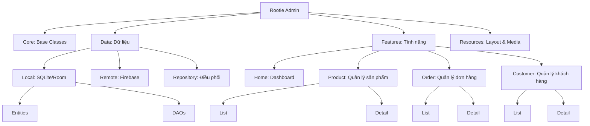

# 🌿 Rootie Admin - Vegan Beauty Application

App quản trị cho hệ sinh thái Rootie (Android Kotlin + Firebase Firestore). Cấu trúc mirror theo app phía User.

> [!WARNING]
> **Cấu hình Firebase chưa được xác nhận (Firebase configuration is not yet confirmed)**.
> Đã thêm file google-services.json. Cần tải thêm file serviceAccountKey.json để tải database

---

## 🏗 Cấu trúc thư mục

* **`com.veganbeauty.admin.core.base`**: Các lớp cơ sở dùng chung (`RootieAdminActivity`, `RootieAdminFragment`, `RootieAdminViewModel`).
* **`com.veganbeauty.admin.data`**:
    * `local/`: Cấu hình Database SQLite/Room (`RootieAdminDatabase`).
    * `local/entities/`: Bản thiết kế dữ liệu (`ProductEntity`, `OrderEntity`, `CustomerEntity`).
    * `local/dao/`: Câu lệnh truy vấn dữ liệu (`ProductDao`, `OrderDao`, `CustomerDao`).
    * `remote/`: Dịch vụ kết nối Firebase (`FirebaseService`).
    * `repository/`: Kết nối local + remote (`ProductRepository`, `OrderRepository`, `CustomerRepository`).
* **`com.veganbeauty.admin.features`**: **NƠI CODE TÍNH NĂNG MỚI.**
    * `home/`: Màn hình dashboard trang chủ (`HomeFragment`, `BottomNavHelper`).
    * `product/`: Quản lý sản phẩm (`list/`, `detail/`, `ProductViewModel` ở gốc).
    * `order/`: Quản lý đơn hàng (`list/`, `detail/`, `OrderViewModel` ở gốc).
    * `customer/`: Quản lý khách hàng (`list/`, `detail/`, `CustomerViewModel` ở gốc).
    * Mỗi folder con chứa: `Fragment`, `Adapter`. `ViewModel` đặt ở folder gốc của tính năng.
* **`res/layout`**: Đặt tên theo quy tắc `tên_tính_năng_loại_file.xml`:
    * `product_fragment_list.xml`, `product_fragment_detail.xml`, `product_item.xml`
    * `order_fragment_list.xml`, `order_fragment_detail.xml`, `order_item.xml`
    * `customer_fragment_list.xml`, `customer_fragment_detail.xml`, `customer_item.xml`

## 🌳 Sơ đồ cấu trúc

## ⚠️ Lưu ý

* Luôn dùng **View Binding** thay vì `findViewById`.
* Logic xử lý dữ liệu nằm trong **ViewModel**, không viết trong Fragment.
* Tạo tính năng mới → tạo folder tương ứng trong `features/`.
